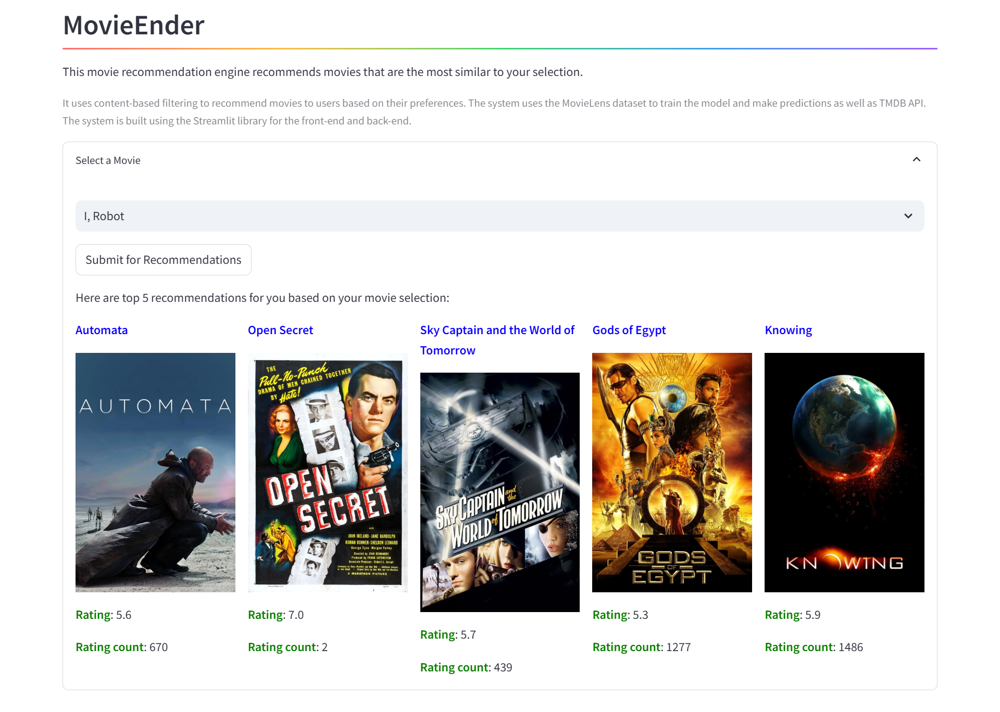

# MovieEnder

A movie recommendation system that uses collaborative filtering to recommend movies to users based on their preferences. The system uses the MovieLens dataset to train the model and make predictions. The system is built using Flask and React for the backend and frontend, respectively.



## Project Structure

The project is structured as follows:

- `app.py`: The main file that contains the code for the Streamlit application
- `/notebooks`: Notebook directory that contains the code for data analysis and model building
- `/app`: Directory that contains the code for the Flask backend and React frontend

## Dataset

The dataset used for this project is the MovieLens dataset. The dataset contains 100,000 ratings and 3,600 tag applications applied to 9,000 movies by 600 users. The dataset can be found [here](https://grouplens.org/datasets/movielens/100k/).

## Features

- User can input their preferences for movies
- The system will recommend movies based on the user's preferences
- The system will display the top 10 recommended movies

## Installation

Use the package manager [pip](https://pip.pypa.io/en/stable/) to install the required packages for the backend and [npm](https://www.npmjs.com/) for the frontend.

Backend (without virtual environment):
```bash
cd app/backend
pip install -r requirements.txt
```

Backend (with virtual environment):
```bash
cd app/backend
python -m venv .venv
source .venv/bin/activate # For Windows: .venv\Scripts\activate
pip install -r requirements.txt
```

Frontend:
```bash
cd app/frontend
npm install
```

## Usage

To run the backend, use the following command:

```bash
cd app/backend
python -m flask run
```

To run the frontend, use the following command:

```bash
cd app/frontend
npm start
```
